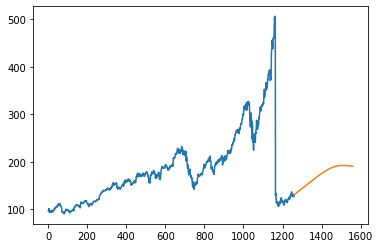

# Deep Learning Projects
This Repository demonstrates some deep learning projects. 

## Project List

| Serial | Project | Key Highlight |
| ------ | ------ | ------ | 
| 1 | Stock Price Prediction | LSTM |
| 2 | Text Summarizer | Encoder, Decoder and Attention model |
| 2 | Digit Recognizer | Convolutional Neural Network |

## Project Details and Results

## 1. Stock Price Prediction using LSTM
A deep learning model based on LSTM neural network to forecast stock prices using
the AAPL stock dataset.
The architecture is made by stacking 3 lstm layers with a connected dense layer to get the regression output. Adam optimizer has been used which is an upgraded version of adagrad optimiser for prevention of high alpha value which may lead to very low learning rate.

#### Results:
RMSE value on test set: 282.67

RMSE value on train set: 164.42

Predition for 300 was made, the prediction curve is demonstrated below:

<a href="https://github.com/yasharma2301/DeepLearningProjects/blob/master/Stock%20Price%20Prediction/Stock_Price_Forecast_Using_LSTM.ipynb">Link to .ipynb notebook</a>.

## 2. Text Summarizer using encoder, decoder and attention model
A deep learning model based on attention model to summarize and generate a summary for the Amazon Fine Food reviews. The data set can be found <a href = "https://www.kaggle.com/snap/amazon-fine-food-reviews">here</a>.

The architecture for this NLP based probelm statement consists of an encoder which is essentially a culmination of stacked lstm layers which genrates the context vector, a decoder which takes in the context vector and further decode it to generate text. In b/w encoder and decoder layers an attention layer is used which is basically a feed forward neural network wrt timestamp Tx which denotes the window size.

**Why use attention model in the first place?**

The former model i.e., encoder decoder model is unable to caputure the essence of entire text at once hence some architecture changes.

#### Results:

| Original Review | Original Summary | Predicted Summary |
| ------ | ------ | ------ | 
| Item tasty healthy mix green mix healthy breakfast great hard workout | refreshing healthy | great breakfast |
| love trying different kinds kcups disappointed caribou rich tasting delicious coffee probably reorder brand next time order | great tasting coffee | great coffee |
| enjoyed way thought would still yummy perfect snack movie date | surprisingly good | yummy |

Note that the original review is pre processed and hence are not perfect english sentences.

<a href="https://github.com/yasharma2301/DeepLearningProjects/blob/master/Text%20Summarizer/TextSummarizer.ipynb">Link to .ipynb notebook</a>.

## 3. Digit Recognizer using CNN
A digit recogniser based using CNN; The architecture consists of 2 Cov2D layers which 64 and 32 filters respectively which  creates a convolution kernel that is wind with layers input which helps produce a tensor of outputs. kernel size of 3 is used with a maxPoolingLayer to reduce the spatial dimensions of the output volume. Finally a Flatten layer is applied.

Moreover callbacks such as ReduceROnPlateau and Early Stopping are used. ReduceROnPlateau essentially means reducing the learning rate when the metric has stopped improving.
<a href="https://www.kaggle.com/c/digit-recognizer">Link to dataset</a>.

#### Results:
Accuracy score: 98.98%

Predicted data:

<a href="https://github.com/yasharma2301/DeepLearningProjects/blob/master/Digits%20Recognizer/DigitRecognizer.ipynb">Link to .ipynb notebook</a>.
